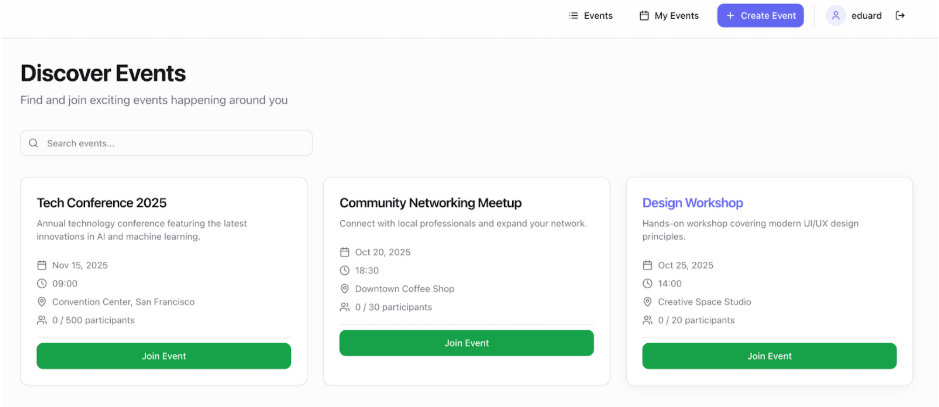
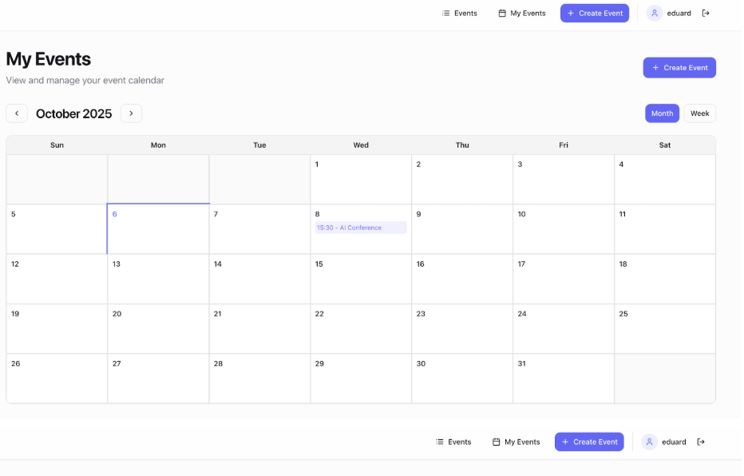
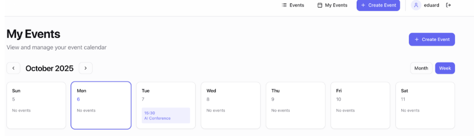
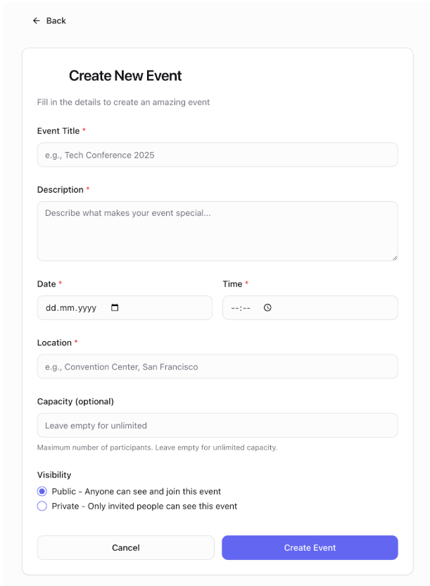

# Personal Project | Stage \#1

## Specification: Event Management System

Your task is to develop a Proof of Concept (PoC) of a simplified Event Management Application. Below are the specific features and requirements.

You can find the design below the task.

## Functional requirements

### **Authentication**

* Users must be able to **sign up** and **log in** using email and password.  
* Passwords should be securely hashed before storage.  
* Show error messages for invalid credentials.  
* Keep users logged in using JWT-based session management.
* Refresh tokens must be issued alongside access tokens on login/register.
* Access token: short-lived (15 min). Refresh token: long-lived (7 days), stored hashed in DB.
* `POST /auth/refresh` — accepts a valid refresh token, returns a new access token + rotated refresh token.
* `POST /auth/logout` — invalidates the refresh token in DB.

### **Events Page (Public List)**

The page should display:

* List of **public events** with:

  * Event Name  
  * Description (short)  
  * Date & Time  
  * Location (text field)  
  * Capacity (if applicable)  
  * Number of participants joined so far

* A button **"Join"** if the user is not yet a participant.  
* A button **"Leave"** if the user is already joined.  
* If an event is full, show a disabled **"Full"** label.  
* Clicking an event opens the **Event Details Page**.

### **Event Details Page**

* Show:

  * Event title, description, date/time, location, capacity.  
  * List of participants (names or initials).  
  * A **Join / Leave button** (depending on user state).

* The organizer should see an **Edit** and **Delete** option.

### **Create Event Page**

* Accessible only to logged-in users.  
* Fields:  
  * Event Title (input)  
  * Description (textarea)  
  * Date & Time (calendar with time picker)  
  * Location (input)  
  * Capacity (number, optional; if not set → unlimited)  
  * Visibility: Public / Private (radio button)  
* Validation:  
  * Title, Date, and Location required.  
  * Cannot create events in the past.  
* On submit:  
  * Store event in DB.  
  * Redirect to Event Details Page.

### **My Events Page (Calendar View)**

* Shows all events where the logged-in user is a **participant or organizer**.  
* Calendar must support **monthly and weekly views**.  
* Each event should display:

  * Title  
  * Time range

* Clicking on the event opens the Event Details Page.  
* If no events: show message:

  * "You are not part of any events yet. Explore public events and join."

### **Event Management**

* **Edit Event**: Organizer can edit details (title, description, time, location, capacity). Changes should be validated again.  
* **Delete Event**: Organizer can delete event. Show confirmation modal:

  * "Are you sure you want to delete this event?"

## Non-Functional requirements

### **User Interface**

* Responsive design optimized for desktop and mobile.  
* Clean, minimal UI with consistent styling across pages.  
* Calendar picker must support selection of date and time.

### **Frontend**

* Use **Typescript \+ React**.  
* Create a React application using CRA/Vite or any other way.  
* Generate components based on wireframes: Login, Events List, Event Details, Create Event, My Events (Calendar).  
* You can use any state manager by your choice (Redux / Zustand)  
* Styling: Tailwind (preferred) or any other library.  
* Use grid/flexbox for alignment.  
* Use React DevTools during development.

### **Backend**

* Use **NodeJS/NestJS** with REST endpoints.  
* Authentication with JWT.  
* Endpoints must cover all operations: register, login, create event, edit event, join/leave event, fetch lists, delete event.  
* Use DTOs for request/response.  
* Validation with **class-validator** (or any native NestJS-compatible approach).  
* Use async/await everywhere.  
* Global error handling via **HttpExceptionFilter** for standardized JSON error responses.  
* Include Swagger for API documentation.

#### **Example endpoints**

| Method | Endpoint | Action |
| :---: | :---: | ----- |
| POST | /auth/register | Register user |
| POST | /auth/login | Login user |
| GET | /events | Fetch public events |
| GET | /events/:id | Fetch single event |
| POST | /events | Create new event |
| PATCH | /events/:id | Edit event |
| DELETE | /events/:id | Delete event |
| POST | /events/:id/join | Join event |
| POST | /events/:id/leave | Leave event |
| GET | /users/me/events | Fetch user's events (calendar) |

### **Database**

* Use **PostgreSQL** with TypeORM (or Prisma).  
* Tables: Users, Events, Participants.  
* Relationships:

  * One user → many organized events.  
  * Many-to-many between users and events (participants).

* Use seeding for sample data (e.g. 2 users, 3 public events).

### **Version Control**

* Use Git \+ GitHub.  
* Minimum 3 commits.  
* Use **develop branch** during implementation.  
* Create PR into **master** when done.

### **Deployment**

* Containerize frontend \+ backend \+ DB using Docker & docker-compose.  
* Deployment is not mandatory, but appreciated.

### **Documentation**

* Provide a **README.md** with setup steps.  
* Automate project launch with one command (docker-compose up).  
* Add .env file or default credentials.  
* If deployed, include a link to the hosted project.

## User Interface

### Home Page / Events

### My Events

### Create Event

---

## Design System

### Design Language
Minimalist, clean, and functional. Whitespace-heavy layouts with a strong visual hierarchy.
Focus on clarity and immediate usability over decorative elements.

### Color Palette
> **Implementation note**: The hex values below are a **visual reference only** — they
> reflect the wireframe's approximate appearance. In code, always use Tailwind/Shadcn
> semantic tokens (`bg-primary`, `text-destructive`, `border-muted`, etc.) which resolve
> to CSS variables (`--primary`, `--destructive`, …) defined in your Shadcn theme.
> Never hardcode hex values in components.

| Token          | Approx. Hex | Shadcn/Tailwind Token         | Usage                                   |
|----------------|-------------|-------------------------------|-----------------------------------------|
| Primary        | #6366f1     | `bg-primary` / `text-primary` | CTA buttons, active nav, accents        |
| Primary Hover  | #4f46e5     | `hover:bg-primary/90`         | Hover state for primary elements        |
| Success/Join   | #22c55e     | `bg-green-500`                | "Join Event" button                     |
| Destructive    | #ef4444     | `bg-destructive`              | Delete actions, required field markers  |
| Background     | #ffffff     | `bg-background`               | Page background                         |
| Surface        | #f9fafb     | `bg-muted`                    | Card backgrounds, sidebar fills         |
| Border         | #e5e7eb     | `border-border`               | Card borders, input borders             |
| Text Primary   | #111827     | `text-foreground`             | Headings, body text                     |
| Text Secondary | #6b7280     | `text-muted-foreground`       | Subtitles, meta information             |
| Text Muted     | #9ca3af     | `text-muted-foreground/60`    | Placeholders, disabled states           |

### Typography
- Font family: Inter (system sans-serif fallback)
- Headings: font-bold, tracking-tight
- Body: font-normal, leading-relaxed
- Scale: text-sm / text-base / text-lg / text-xl / text-2xl / text-3xl (Tailwind)

### Layout & Grid
- Max content width: 1280px, centered
- Horizontal padding: px-4 (mobile) → px-6 (tablet) → px-8 (desktop)
- Event cards grid: 1 column (mobile) → 2 columns (tablet) → 3 columns (desktop)
- Gutter: gap-6

### Navigation
- Fixed top bar, full width, white background with border-b
- Left: logo / brand
- Right: "Events" link, "My Events" link, "+ Create Event" button (primary), user avatar chip, logout icon

### Component Specifications

#### Event Card
- White background, rounded-xl, border, shadow-sm
- Title: text-lg font-semibold
- Description: text-sm text-secondary, 2-line clamp
- Meta row icons: lucide-react (Calendar, Clock, MapPin, Users)
- CTA: full-width "Join Event" button (success green) or "Leave Event" (outline) or "Full" (disabled)

#### Form (Create/Edit Event)
- Centered card layout, max-w-lg, rounded-2xl, border, shadow-md
- Required fields marked with red asterisk
- Inputs: rounded-lg, border, focus:ring-primary
- Date + Time: separate native inputs side by side
- Visibility: radio group (Public / Private)
- Actions: Cancel (outline) + Submit (primary) in a flex row

#### Calendar (My Events)
- Month / Week toggle in top-right (active state: primary bg, white text)
- Month view: 7-column grid, events as primary-colored pills
- Week view: 7-column day cards, events as indigo pills with time prefix
- Empty state message centered in the calendar area

#### Modal (Delete Confirmation)
- Centered overlay, rounded-xl, shadow-lg
- Title: "Are you sure?"
- Body: "This action cannot be undone."
- Actions: Cancel (outline) + Delete (destructive red)

### Responsiveness
- Mobile-first. Every component tested at 375px, 768px, 1280px.
- Hamburger menu or bottom nav for mobile (if needed).
- Calendar collapses to list view on mobile if full grid is not readable.

### Feedback & States
- Every async action shows a loading spinner on the button.
- Success: shadcn `<Toast>` (top-right, green variant).
- Error: shadcn `<Toast>` (top-right, destructive variant).
- Full event: "Full" label replaces Join button (disabled, gray).